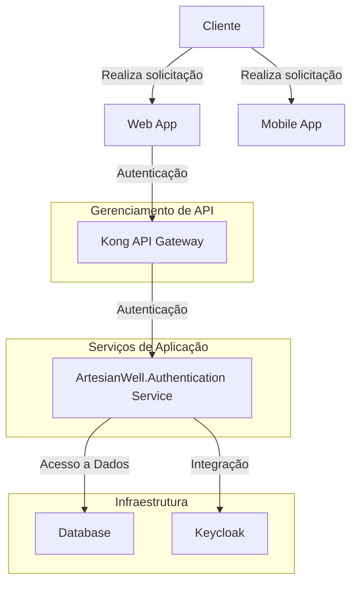
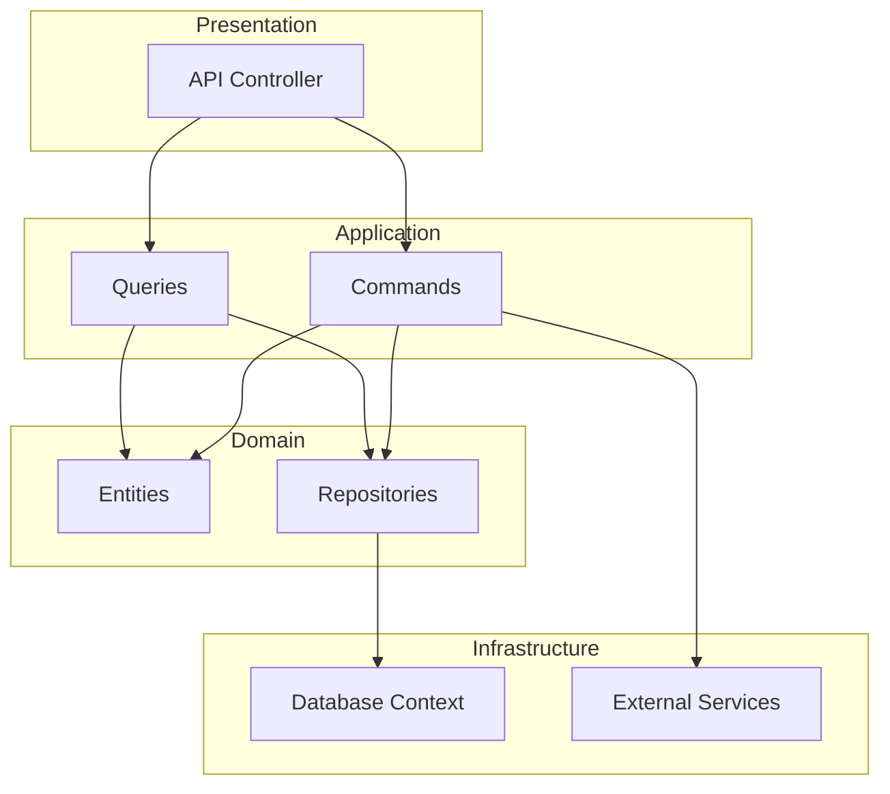

# ArtesianWell.Authentication
Manager Authentication of Artesian Well

##Design Document: ArtesianWell.Authentication Service

### Introdução

O serviço **ArtesianWell.Authentication** é um componente essencial do sistema Poços Artesianos, responsável pela autenticação e autorização dos usuários. Construído utilizando o .NET 8, este serviço adota uma arquitetura limpa, seguindo os princípios CQRS (Command Query Responsibility Segregation) e os princípios SOLID para garantir um código robusto, escalável e de fácil manutenção.

### Objetivo

Este documento visa fornecer uma visão detalhada da arquitetura do serviço **ArtesianWell.Authentication**, explicando suas camadas e componentes. Também abordaremos o processo de instalação utilizando Docker.

### Arquitetura

A arquitetura do serviço **ArtesianWell.Authentication** é baseada em uma abordagem de arquitetura limpa, dividida nas seguintes camadas:

- **Application:** Contém a lógica de aplicação e os casos de uso (Commands e Queries).
- **Presentation:** Camada responsável pela comunicação com o mundo externo (APIs).
- **Domain:** Define as entidades, interfaces de repositório e regras de negócio.
- **Infrastructure:** Implementações específicas de infraestrutura, como acesso a banco de dados e integração com outros serviços.

### Diagrama C4

**Context Diagram:**



**Container Diagram:**



### Camadas do Projeto

**1. Presentation**

- **API Controllers:** Exponha os endpoints da API para interação com os clientes.
- **Autenticação e Autorização:** Gerencie a autenticação e autorização utilizando Keycloak via Kong API Gateway.

**2. Application**

- **Commands:** Contém a lógica de manipulação de dados (escrita).
- **Queries:** Contém a lógica de consulta de dados (leitura).
- **DTOs (Data Transfer Objects):** Defina os modelos de dados utilizados nas interfaces públicas.

**3. Domain**

- **Entities:** Define as entidades principais do sistema, como `User`, `Role`, etc.
- **Value Objects:** Objetos de valor que encapsulam propriedades que formam conceitos do domínio.
- **Interfaces de Repositório:** Defina contratos para acesso a dados.

**4. Infrastructure**

- **Database Context:** Implementações específicas de acesso a banco de dados utilizando Entity Framework.
- **Repositories:** Implementações dos repositórios definidos na camada de domínio.
- **External Services:** Integrações com Keycloak para gerenciamento de autenticação e autorização.

### Instalação com Docker

Para facilitar a instalação e execução do serviço **ArtesianWell.Authentication**, usaremos o Docker. Abaixo estão os passos para configurar o ambiente Docker.

**1. Dockerfile**

Crie um arquivo `Dockerfile` na raiz do projeto:

```
FROM mcr.microsoft.com/dotnet/sdk:8.0 AS build
WORKDIR /app

# Copiar arquivos csproj e restaurar dependências
COPY *.csproj .
RUN dotnet restore

# Copiar o restante do código e compilar
COPY . .
RUN dotnet publish -c Release -o out

FROM mcr.microsoft.com/dotnet/aspnet:8.0 AS runtime
WORKDIR /app
COPY --from=build /app/out .
ENTRYPOINT ["dotnet", "ArtesianWell.Authentication.dll"]

```

**2. docker-compose.yml**

Crie um arquivo `docker-compose.yml` para orquestrar os serviços:

```yaml
version: '3.8'

services:
  artesianwell.authentication:
    image: artesianwell.authentication:latest
    build:
      context: .
      dockerfile: Dockerfile
    ports:
      - "5001:80"
    environment:
      - ASPNETCORE_ENVIRONMENT=Development
      - ConnectionStrings__DefaultConnection=Host=postgres;Database=artesianwellauth;Username=artesianwellauth;Password=yourpassword
      - Keycloak__ServerUrl=http://keycloak:8080/auth
      - Keycloak__Realm=ArtesianWell
      - Keycloak__ClientId=artesianwell-client
      - Keycloak__ClientSecret=YOUR_CLIENT_SECRET
    depends_on:
      - postgres
      - keycloak

  postgres:
    image: postgres:13
    environment:
      POSTGRES_DB: artesianwellauth
      POSTGRES_USER: artesianwellauth
      POSTGRES_PASSWORD: yourpassword
    ports:
      - "5432:5432"
    volumes:
      - postgres_data:/var/lib/postgresql/data

  keycloak:
    image: quay.io/keycloak/keycloak:latest
    environment:
      KEYCLOAK_ADMIN: admin
      KEYCLOAK_ADMIN_PASSWORD: admin
      KC_DB: postgres
      KC_DB_URL_HOST: postgres
      KC_DB_URL_PORT: 5432
      KC_DB_USERNAME: artesianwellauth
      KC_DB_PASSWORD: yourpassword
      KC_DB_DATABASE: artesianwellauth
    ports:
      - "8080:8080"
    depends_on:
      - postgres

volumes:
  postgres_data:

```

**3. Comandos de Instalação**

Execute os seguintes comandos para iniciar os serviços:

```bash
# Construir a imagem Docker
docker-compose build

# Iniciar os serviços
docker-compose up
```